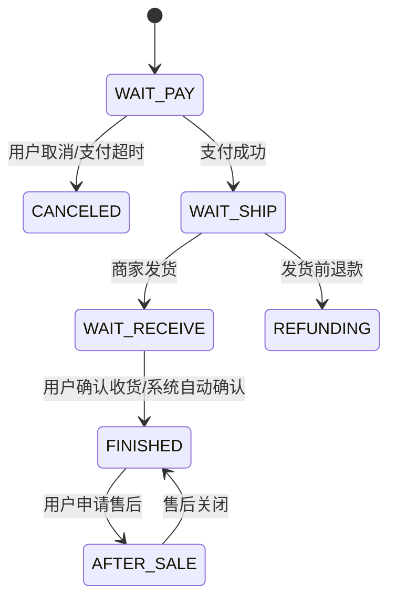

# 需求文档 01：智能订单履约与售后协同系统

## 1. 文档信息

| 项目 | 内容 |
|---|---|
| 系统名称 | 智能订单履约与售后协同系统 |
| 模块范围 | 下单、库存锁定、支付、发货、售后申请、退款审批 |
| 适用终端 | Web 管理端、H5 用户端、开放 API |
| 优先级 | P0 |
| 版本 | v1.3.0 |
| 编写日期 | 2026-05-02 |

## 2. 背景说明

当前电商平台存在订单状态流转复杂、库存锁定不一致、售后流程人工判断成本高等问题。系统需要支持多渠道订单接入，并在用户支付、商家发货、用户申请退款/退货时自动完成状态校验、金额计算、库存回滚和消息通知。

本需求重点验证：

1. 订单主流程的状态流转是否正确；
2. 库存锁定、释放、扣减是否符合规则；
3. 支付和退款金额是否一致；
4. 售后申请是否受到订单状态、时间窗口、商品属性限制；
5. 管理端人工审核和系统自动审核是否可以协同工作。

## 3. 角色定义

| 角色 | 权限说明 |
|---|---|
| 普通用户 | 创建订单、支付订单、取消订单、申请售后 |
| 商家运营 | 查看订单、确认发货、处理售后 |
| 财务人员 | 查看支付流水、审批大额退款 |
| 平台管理员 | 修改售后策略、强制关闭异常订单 |
| 系统任务 | 超时取消、自动确认收货、自动退款 |

## 4. 核心业务流程

### 4.1 创建订单

用户选择商品后提交订单。系统需要校验商品是否上架、库存是否充足、收货地址是否完整、优惠券是否可用。

业务规则：

- 单笔订单最多允许包含 50 个 SKU；
- 商品数量必须大于 0；
- 商品已下架时不允许提交订单；
- 用户存在未完成风控校验时不允许下单；
- 使用优惠券时，订单实付金额必须大于等于优惠券最低使用门槛；
- 同一用户在 10 秒内重复提交完全相同的购物车内容，应返回上一笔待支付订单。

### 4.2 库存锁定

订单创建成功后，系统锁定库存。库存锁定有效期为 30 分钟。

库存规则：

- 下单成功后增加 `locked_stock`；
- 支付成功后减少 `available_stock` 和 `locked_stock`；
- 订单取消后减少 `locked_stock`；
- 支付超时后自动释放库存；
- 如果部分 SKU 库存不足，整个订单创建失败，不允许部分成功。

### 4.3 支付处理

支付系统通过异步回调通知订单系统支付结果。

支付规则：

- 只有 `WAIT_PAY` 状态订单可以支付；
- 支付金额必须等于订单应付金额；
- 重复支付回调需要幂等处理；
- 支付成功后订单状态变更为 `WAIT_SHIP`；
- 支付失败时订单仍保持 `WAIT_PAY`；
- 支付成功后需要生成支付流水。

### 4.4 发货处理

商家运营可以对待发货订单进行发货操作。

发货规则：

- 只有 `WAIT_SHIP` 状态订单允许发货；
- 物流单号不能为空；
- 同一个订单不允许重复发货；
- 虚拟商品不需要物流单号，发货后直接进入 `FINISHED`；
- 实物商品发货后进入 `WAIT_RECEIVE`。

### 4.5 售后申请

用户可以在订单完成后的 7 天内申请售后。

售后规则：

- 未支付订单不允许申请售后；
- 已取消订单不允许申请售后；
- 虚拟商品不支持无理由退款；
- 同一个订单同一个 SKU 同时只能存在一个进行中的售后单；
- 退款金额不能超过商品实际支付金额；
- 大于 5000 元的退款申请需要财务二次审批。

## 5. 状态机定义



## 6. 接口定义

### 6.1 创建订单接口

`POST /api/order/create`

请求参数：

| 字段 | 类型 | 必填 | 说明 |
|---|---|---|---|
| user_id | string | 是 | 用户 ID |
| address_id | string | 是 | 收货地址 ID |
| coupon_id | string | 否 | 优惠券 ID |
| sku_items | array | 是 | SKU 列表 |
| sku_items[].sku_id | string | 是 | SKU ID |
| sku_items[].quantity | integer | 是 | 购买数量，必须大于 0 |
| client_request_id | string | 是 | 客户端请求 ID，用于幂等 |

响应示例：

```json
{
  "code": 0,
  "message": "success",
  "data": {
    "order_id": "ORD_202605020001",
    "order_status": "WAIT_PAY",
    "pay_amount": 129.90,
    "expire_time": "2026-05-02 15:30:00"
  }
}
```

### 6.2 支付回调接口

`POST /api/payment/callback`

关键校验：

- `payment_no` 不能为空；
- `order_id` 必须存在；
- `pay_amount` 必须与订单应付金额一致；
- 已处理成功的 `payment_no` 再次回调时直接返回成功；
- 签名校验失败时返回 `401`。

### 6.3 售后申请接口

`POST /api/after-sale/apply`

请求参数：

| 字段 | 类型 | 必填 | 说明 |
|---|---|---|---|
| order_id | string | 是 | 订单 ID |
| sku_id | string | 是 | 商品 SKU |
| reason_code | string | 是 | 售后原因 |
| refund_amount | decimal | 是 | 申请退款金额 |
| evidence_urls | array | 否 | 凭证图片 |
| apply_type | string | 是 | REFUND_ONLY / RETURN_REFUND |

## 7. 异常场景

1. 用户重复点击提交订单按钮；
2. 支付回调早于订单创建事务提交；
3. 支付成功后库存扣减失败；
4. 用户取消订单和支付成功回调并发到达；
5. 发货后用户立即申请退款；
6. 售后审核通过后退款接口超时；
7. 财务审批拒绝大额退款；
8. 物流单号重复；
9. 库存锁定任务重复执行；
10. 部分商品不支持售后。

## 8. 验收标准

- 创建订单成功率在正常库存场景下不低于 99.9%；
- 支付回调必须具备幂等能力；
- 所有订单状态变更必须有操作日志；
- 售后退款金额计算必须可追溯；
- 库存锁定和释放必须与订单状态一致；
- AI 生成测试用例时，需要覆盖正常流程、异常流程、边界值、并发幂等、权限控制和状态流转。

## 9. 测试关注点提示

- 状态机转换合法性；
- 库存一致性；
- 支付回调幂等；
- 退款金额边界；
- 订单和售后并发冲突；
- 大额退款二次审批；
- 物流信息校验；
- 超时任务重复执行。
