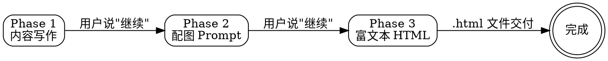

# 公众号文章生产流程

## 核心原则

1. **内容优先，排版辅助** — 先写对，再出图，再发布。
2. **阶段产出要可验证** — 每个阶段都有可勾选的产物，不靠"我觉得不错"。
3. **流程可被打断** — 任意阶段完成后等用户确认，不替用户代劳决策。

## 三阶段流程图

| 阶段 | 解决什么问题 | 产物 | 必读规则 |
|------|-------------|------|---------|
| Phase 1 | 选题没把握、结构散、写不出 | 2500~3500 字 Markdown 正文 | `writing-style-baseline` `writing-constraints` `writing-topic-selection` `writing-article-planning` `writing-full-draft` `writing-self-check` |
| Phase 2 | 不知道配什么图、风格不统一 | 封面 + 6 张正文配图 Prompt（中英双语） | `visuals-structure-extraction` `visuals-cover-prompt` `visuals-body-prompt` `visuals-output-format` `visuals-prompt-quality` |
| Phase 3 | 排版兼容性差、不会做复制器 | 可直接粘贴到公众号后台的 `.html` 文件 | `publish-delivery-contract` `publish-response-guardrails` `publish-html-structure` `publish-copy-logic` `publish-style-rules` `publish-article-processing` |

## 入口索引

- **必读基线**：`rules/writing-style-baseline.md`、`rules/writing-constraints.md`
- **必看示例**：`examples/README.md`（每个阶段都看一个对照产物）
- **Phase 3 工具栏源码**：`snippets/toolbar.html`（被 `publish-html-structure` 和 `publish-copy-logic` 引用，不要在规则里重复贴）

## 阶段衔接

- **Phase 1 → Phase 2**：消费的是"正文成稿"，产出 6 个核心章节名 + 1 个主题词。
- **Phase 2 → Phase 3**：消费的是"正文成稿 + 配图占位块标记"，产出可直接发布的 `.html` 文件。
- **Phase 3 完成后**：用户下载、Chrome/Edge 打开、点"复制富文本"、粘到公众号后台、替换图片占位块 — 这五步用 publish-delivery-contract 的最终回复形状。

## Red Flags — 立刻停手

- ❌ 在 Phase 3 把 HTML/JS 源码贴进回复（违反 publish-delivery-contract）
- ❌ 跳过 7 项选题分析直接写正文
- ❌ 字数超过 3500 字硬上限（不在文末砍，REFACTOR 重写）
- ❌ 用 `writeText` 或 `innerHTML` 替代 `ClipboardItem + outerHTML`（publish-copy-logic 明确禁止）
- ❌ 配图 Prompt 里出现粉色调、卡通、五彩（破坏 visuals-body-prompt 的 design token）
- ❌ 虚构用户没给过的"旧文"或"您上次说过"
- ❌ 把"先写一版代码"作为跳过文件交付的借口

## Rationalization 表 — agent 常用的自我说服

| Excuse | Reality |
|--------|---------|
| "用户赶时间，贴代码更快" | publish-delivery-contract 明确：快捷指令不构成豁免 |
| "旧文里写过但我忘了标题" | 没记录就说"未找到"，不要编造 |
| "用户没给栏目，我反问" | writing-topic-selection 有"无栏目库默认推断"，不要反问 |
| "长文硬塞一文方便用户" | 2500-3500 是硬上限，超出 REFACTOR 重写或拆篇 |
| "用户要粉色调就给他" | visuals-body-prompt 的 design token 是为阅读一致性服务的，礼貌拒绝 |
| "贴部分代码让用户先确认" | publish-response-guardrails：中途也不得贴源码 |
| "测试场景是假设的不用真跑" | writing-skills TDD：基线必须真跑过才写规则 |
